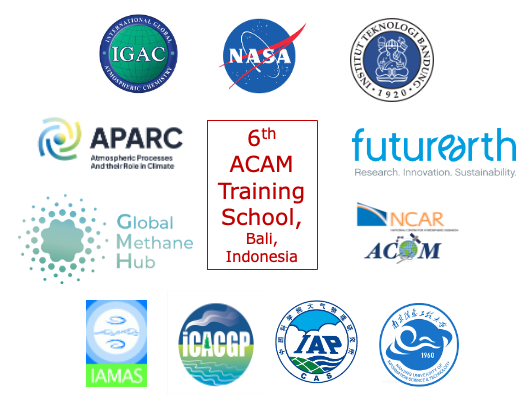

<!-- 

  

 -->

# 6th Atmospheric Composition And The Asian Monsoon (ACAM) Training School 
**Exploring Atmospheric Composition and Remote Sensing**  
*Bali, Indonesia | 9-10 June 2025*

---

  

## Table of Contents
1. [About the Event](#About-the-Event)
2. [Program Schedule](#program-schedule)
3. [Speakers and Materials](#speakers-and-materials)
4. [Shared Resources](#shared-resources)
5. [Setup Instructions](#setup-instructions)
6. [Contact and Support](#contact-and-support)

---

## About the Event  
Welcome to the 6th ACAM Training School! Building on the success of previous training schools, this training school aims to enhance skills in atmospheric composition analysis, satellite remote sensing, modeling of atmospheric chemistry and data science through lectures and hands-on tutorials. This repository contains materials, schedules, and resources for participants. Join us to explore atmospheric science through expert-led sessions and hands-on projects.

- **When**: 9-10 June 2025  
- **Where**: Bali, Indonesia 
- **Organizers**: Dr. Ritesh Gautam (EDF, USA), Dr. Puji Lestari (ITB, Indonesia), Dr. Piyushkumar Patel (SRON, Netherlands)
- **Focus**: Aerosol, cloud, and methane analysis using satellite data, with practical exercises and project work. 
<!-- - **Led by**: Dr. Ritesh Gautam, Dr. Piyushkumar Patel   -->

### Learning Objectives

The training aims to enable participants to be aware of satellite- and model-based products, with the following learning objectives:
- To learn and understand different satellite observation and modeling principles for air quality research
- To find and use satellite- and model-based data products for air quality research
- To use standard Python packages to handle, process, and visualize the data
- To identify advantages and limitations of each data product introduced

---

## Program of the Training School

### Monday, 9 June 2025

| Time | Speaker | Topic | Materials |
| --- | --- | --- | --- |
| 09:00 - 09:15 | Dr. Ritesh Gautam, Dr. Puji Lestari, Dr. Piyushkumar Patel | Welcome & Logistics | - |
| 09:15 - 10:00 | Dr. James Crawford | Overview of ACAM & ASIA-AQ | - |
| 10:00 - 11:00 | Dr. Piyushkumar Patel         | Aerosol-Cloud Satellite Remote Sensing            | [Repository](https://github.com/PiyushPatel/Aerosol_Cloud_Remote_Sensing) |
| 11:30 - 12:30 | Dr. Piyushkumar Patel         | SPEXone Satellite Aerosol Data Analysis           | [Repository](https://github.com/PiyushPatel/SPEXone_Analysis)            |
| 14:00 - 16:00 | Dr. Cathy Clerbaux            | Satellite Observations of Atmospheric Composition | [Repository](https://github.com/CathyClerbaux/IASI_Satellite_Data)       |
| 16:30 - 17:30 | All Instructors               | Introduction of Project Work                      | [Guidelines](https://github.com/PiyushPatel/ACAM_2025_Project_Work)      |

### Tuesday, 10 June 2025

| Time | Speaker | Topic | Materials |
| --- | --- | --- | --- |
| 09:00 - 10:45 | Dr. Naveen Chandra | Inverse Modeling for Methane Emission Quantification | [Repository](https://github.com/NaveenChandra/Methane_Analysis) |
| 11:00 - 12:45 | Dr. Jonathan Wright | Composition-Circulation Coupling in the Asian Monsoon | [Repository](https://github.com/JonathanWright/Composition_Circulation) |
| 14:00 - 16:00 | All Instructors | Project Work | [Datasets](https://github.com/PiyushPatel/ACAM_2025_Project_Work/tree/main/datasets) |
| 16:15 - 17:30 | All Presenters | Presentations of Projects | - |

---

The training school consists of two parts:
- Preparation event (online)
- Training school (on-site)

### Preparation Event (Online)

This online event will take place before the on-site training school. Lecturers will introduce participants to the training school program as well as the data and tools that will be used during the on-site part. Participants will have a chance to familiarize themselves with the training platform and to register for different data access services.

It is recommended to follow along with the laptop you plan to bring to the on-site school.

**NOTE**: Participation in the preparation event is strongly recommended.

### Training School (On-site)

The on-site training school will have a mixture of:
1. Scientific lectures
2. Practical data discovery
3. Project work

#### Scientific Lectures

The scientific lectures will be given by experts on a range of topics:
- Principles of observing air quality from satellites
- Principles of aerosols from satellites
- Principles of modeling and introduction to global models
- Principles of data assimilation and reanalysis data

#### Practical Data Discovery

There will be practical data discovery sessions where participants will get a practical introduction to different satellite and model-based datasets. The practical parts will be conducted via dedicated training materials and guided exercises.

#### Project Work

Project work is a component where participants can apply what they learned during the scientific lectures and the practical data discovery sessions. Participants can come with an idea for the project to the training school or decide on a project while they are there. They can work alone or together as a team. Teams will be formed according to similar interests and project ideas. Participants shall present the outcomes of their projects at the end of the training school.

**NOTE**: Participants will require a laptop and charger for the on-site part of the training school.

## Training Materials

Training materials will be made available to participants through this GitHub repository. Links to specific sessions and materials will be added as they become available.

### Speaker Materials

| Speaker | Topic | Materials |
|---------|-------|-----------|
| TBD | TBD | [Link to materials](#) |
| TBD | TBD | [Link to materials](#) |
| TBD | TBD | [Link to materials](#) |

### Additional Resources

- [Link to training school material repository](#)
- [Additional resources](#)

## Organizers and Sponsors

The training school is organized and sponsored by:
- IGAC
- SPARC
- [Additional sponsors to be added]

## Contact

For any questions regarding the training school, please contact:
- [Contact information to be added]

