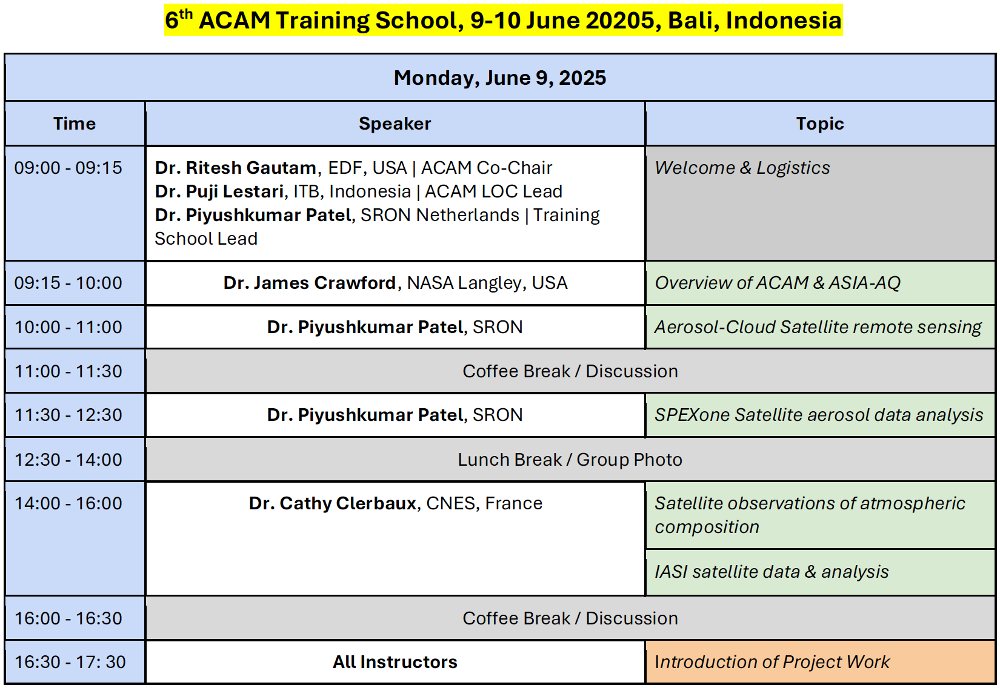
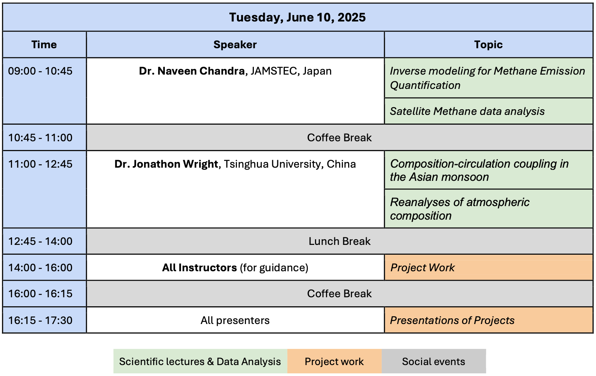

  

<!-- # 6th Atmospheric Composition And The Asian Monsoon (ACAM) Training School 
**Exploring Atmospheric Composition and Remote Sensing**  
*Bali, Indonesia | 9-10 June 2025* -->

  

---

## Table of Contents
1. [About the Event](#about-the-event)
2. [Program of the Training School](#program-of-the-training-school)
3. [Training Materials](#training-materials)
4. [Contact](#contact)

---

## About the Event  
Welcome to the 6th ACAM Training School! Building on the success of previous training schools, this training school aims to enhance skills in atmospheric composition analysis, satellite remote sensing, modeling of atmospheric chemistry and data science through lectures and hands-on tutorials. This repository contains materials, schedules, and resources for participants. Join us to explore atmospheric science through expert-led sessions and hands-on projects.

- **When**: 9-10 June 2025  
- **Where**: Bali, Indonesia 
- **Organizers**: Dr. Piyushkumar Patel (SRON, Netherlands), Dr. Ritesh Gautam (EDF, USA), Dr. Puji Lestari (ITB, Indonesia)
- **Intructors**: Dr. Cathy Clerbaux (CNES, France), Dr. Jonathon Wright (Tsinghua University, China), Dr. Naveen Chandra (JAMSTEC, Japan), Dr. Piyushkumar Patel (SRON, Netherlands)
- **Focus**: Atmospheric composition analysis using satellite data and models, with practical exercises and project work. 
<!-- - **Led by**: Dr. Ritesh Gautam, Dr. Piyushkumar Patel   -->

### Learning Objectives

The training aims to enable participants to be aware of satellite- and model-based products, with the following learning objectives:
- To learn and understand different satellite observation and modeling principles for atmospheric compostion and air quality research
- To find and use satellite- and model-based data products for their research
- To use standard Python packages to handle, process, and visualize the data
- To identify advantages and limitations of each data product introduced

---

## Program of the Training School

  
  

The training school consists of two parts:
- Preparation event (online)
- Training school (on-site)

### Preparation Event (Online)

This online event will take place before the on-site training school. Lecturers will introduce participants to the training school program as well as the data and tools that will be used during the on-site part. Participants will have a chance to familiarize themselves with the training platform and to register for different data access services.

The reuired turorial or documents will be shared here.

**NOTE**: Participation in the preparation event is strongly recommended.

### Training School (On-site)

The on-site training school will have a mixture of:
1. Scientific lectures
2. Practical data discovery
3. Project work

#### Scientific Lectures

The scientific lectures will be given by experts on a range of topics:
- Principles of observing various atmospheric compostions from satellites
- Principles of modeling and introduction to global models
- Principles of reanalysis data

#### Practical Data Discovery

There will be practical data discovery sessions where participants will get a practical introduction to different satellite and model-based datasets. The practical parts will be conducted via dedicated training materials and guided exercises.

#### Project Work

Project work is a component where participants can apply what they learned during the scientific lectures and the practical data discovery sessions. Participants can come with an idea for the project to the training school or decide on a project while they are there. They can work alone or together as a team. Teams will be formed according to similar interests and project ideas. Participants shall present the outcomes of their projects at the end of the training school.

**NOTE**: **Participants will require a laptop and charger (+ if needed, an adapter for Indonesia electrical outlets) for the on-site part of the training school.**

---

## Training Materials

Training materials will be made available to participants through this GitHub repository. Links to specific sessions and materials will be added as they become available.

### Speaker Materials

| Speaker | Topic | Materials | Code/Scripts |
|---------|-------|-----------|-------------|
| Dr. Piyushkumar Patel | Aerosol-Cloud Remote Sensing | [Materials/Note](https://github.com/PiyushPatel/ACAM_2025_Materials/aerosol) | [Scripts & Data](https://github.com/PiyushPatel/ACAM_2025_Scripts/aerosol) |
| Dr. Cathy Clerbaux | Atmospheric Composition | [Materials/Note](https://github.com/CathyClerbaux/IASI_Materials) | [Scripts & Data](https://github.com/CathyClerbaux/IASI_Scripts) |
| Dr. Naveen Chandra | Methane Emission Modeling | [Materials/Note](https://github.com/NaveenChandra/Methane_Materials) | [Scripts & Data](https://github.com/NaveenChandra/Methane_Analysis) |
| Dr. Jonathon Wright | Asian Monsoon Dynamics | [Materials/Note](https://github.com/JonathonWright/Monsoon_Materials) | [Scripts & Data](https://github.com/JonathonWright/Composition_Circulation) |

### Additional Resources

- [Link to training school material repository](#)
- [Additional resources](#)

---

## Contributors

This repository is maintained by:
- Dr. Piyushkumar Patel ([piyushether@gmail.com](mailto:piyushether@gmail.com))
- Dr. Jonathon Wright ([jonathonswright@protonmail.com](mailto:jonathonswright@protonmail.com))

## Contact

For any questions regarding the training school, please contact:
- Dr. Piyushkumar Patel ([p.patel@sron.nl](mailto:p.patel@sron.nl) / [piyushether@gmail.com](mailto:piyushether@gmail.com))

